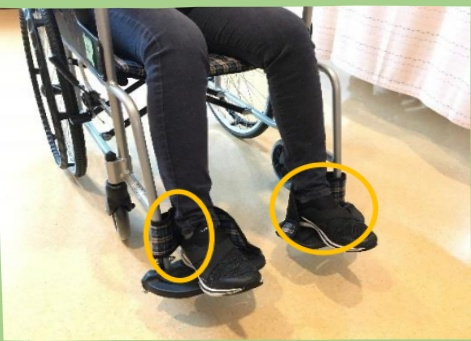

|  |  | 单侧无力病人的摆放注意事项～躺姿～ |
|---|---|---|
| **目的**：1. 避免形成压疮、关节挛缩等不良姿势。2. 维持舒适姿势。 |  | 以右侧偏瘫为例 |
| **注意事项**：1. 每两个小时变换姿势，并检查受压侧皮肤是否出现压疮。2. 若有水脑、或骨折处，需依医师指示调整姿势。3. 使用呼吸器、尿管者，请留意勿拉扯。 |  |  |
| **仰躺** |  |  |
| 1. 头颈部：用枕头垫高。2. 患侧手：下方放置枕头，手肘伸直，手心向上/下。3. 患侧脚：放在正中位置，大腿外侧放毛巾卷（避免过度外转），膝下方稍微垫高（避免膝过度伸直），脚踝垂直，不歪斜 |  |  |
|  |  |  |
| **侧躺～患侧在上～** |  |  |
| 1. 头颈部：用枕头垫高。2. 患侧手：放在身体前方，下方用枕头或棉被垫高，手肘微弯，手腕伸直，手心向下。3. 患侧脚：向前弯曲，髋、膝、踝下方放置棉被等支撑物。 |  |  |
| **侧躺～患侧在下～** |  |  |
| 1. 头颈部：用枕头垫高。2. 躯干：背、臀后方有支撑，身体微向后。3. 患侧：手放在身体前方，肩胛骨稍微往前拉，手心向上，脚微弯。4. 健侧脚：向前弯曲，髋、膝、踝下方放置棉被等支撑物。 |  |  |## Positioning Guidelines for Patients with Unilateral Weakness – Sitting Position

Benefits of sitting posture:  
1. Regulates blood pressure  
2. Reduces pressure sores  
3. Enhances sensory stimulation  
4. Affects lung capacity  

Make good use of the stronger side limbs  
to assist in body movement!  

Hold the headboard or rail with the stronger hand, and place the feet on the bed's backrest.  
Use both hands and feet simultaneously to lift the body until the head touches the headboard.  

Method One  
☐: Place a pillow under the affected side's elbow and forearm, palm down.  

Method Two  
☐: Place a cotton blanket or similar between the feet and the bed's backrest  

Prevent the buttocks from sliding down!!

## Method One:  
☐: Place the feet against a rolled cotton blanket at the bed's backrest  
Keep the knees straight and maintain a straight line from the back of the bed to prevent the buttocks from sliding down.  

Method Two:  
Place the feet against a rolled cotton blanket at the bed's backrest, and elevate the bed's backrest to prevent the buttocks from sliding down.| | |
| :--- | :--- |
|  | 个子较小的病人：可在下背部放置小枕头，提供腰椅支撑，以维持直立姿势。个子较高的病人：贴紧椅背，以维持直立姿势。 |
|  | 在大腿放置枕头，让患侧手肘及前臂有支撑，以免滑落。 |
|  | 双脚放在踏板上。正确使用脚跟后方的固定带，能避免足部滑落。 |

## Notes when sitting up:

1. Is blood pressure stable?

2. Do you feel dizziness?

3. Is there a fracture?

4. Please discuss with medical staff and therapists regarding the height, duration, and frequency of sitting up.

Phone: 07-6150011#2330

