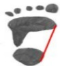

# Understanding Pediatric Flat Feet and Rehabilitation Exercises

## What is flat feet?

The human foot has a "arch" structure. Flat feet refer to the phenomenon where the foot arch collapses and disappears when standing or walking.

Normal foot arch

High arch

Flat foot arch

## How to identify flat feet from footprints:

Severe

flat feet

Mild

flat feet

Normal

High arch

## @ What should be done about flat feet?

Before 2 years old: Infants have not fully developed foot arches, and their soles have thick soft tissues, so their appearance appears flat before age 2.

2–8 years (foot arch development period): Strengthening exercises or orthotic insoles can be used to promote the development of the foot arch.

After age 8: Functional insoles can be used to correct abnormal biomechanics.

If a child complains of foot pain after walking for a while, easily falls, or has "out-turned" or "in-turned" gait, it is recommended to consult a rehabilitation physician or physical therapist for evaluation.

## 1. Purpose of exercises: Enhance the strength of the small muscles in the foot to support the arch  
## 2. Exercise prescription: See the diagram below.

| Exercise | Description |
|--------|-------------|
| Toe-pointing exercise | Support for 5 seconds, then slowly lower back to the ground. Repeat 10 times. |
| Toe-grabbing exercise | Grasp a towel or small objects with the toes, hold for 5 seconds, then release. Repeat 10 times. |
| Jumping and walking on uneven surfaces | Perform jumping and walk on uneven ground to promote foot muscle development. Do 10 repetitions each time. |
| Stretching exercise | Perform lunge stance, slowly lower the body, hold for 10 seconds. Repeat 10 times. |

## References: Hara, et al., The effects of short foot exercises to treat flat foot deformity: a systematic review. Journal of Back and Musculoskeletal Rehabilitation, 2023 Jan, 36(1):21-33

Yi Da Hospital

Address: No. 1, Yida Road, Jiaoshu Village, Yancheng District, Kaohsiung City

## Contact Information

Phone: 07-6150011

Yi Da Cancer Treatment Hospital

Address: No. 21, Yida Road, Jiaoshu Village, Yancheng District, Kaohsiung City

Phone: 07-6150022

Yi Da Da Chang Hospital

Address: No. 305, Dachang Road, Sanyin District, Kaohsiung City

Phone: 07-5599123

Yi Da Medical Foundation, 21×29.7cm, Printed in 2025.08

Revised in May 2025, HA-11-0035(2)