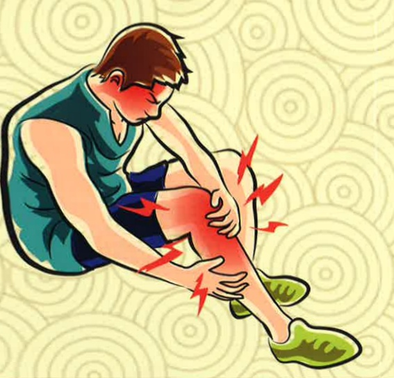

## Four. References

Chen Guanghui (2019). Traditional Chinese Nursing Procedures. Edited by Zhang Yongxian and Zhang Manling. Introduction to Chinese Nursing (4th ed., pp. 227–250). Xinwenjing Development.

Lu Wenhui (2019). Traditional Manual Treatment for Acute Trauma in Traditional Chinese Medicine. Taipei: Taipei Association of Traditional Chinese Medicine Practitioners.

Chang Weixiu, Chen Jianlin, Huang Jianrong, Huang Huifeng (2019). A Comprehensive Discussion on the Treatment of Ankle Sprains from Both Traditional Chinese and Western Medicine. *Journal of Chinese Medicine Research*, 22(2): 31–44.

Yu Zhenzheng (2021). The Traditional Chinese Medical Perspective on Sports Injuries. *Consumer Reports Magazine*, 482, 31–33.

Yi Da Hospital  
Address: No. 1, Yida Road, Jiaosu Village, Yanchao District, Kaohsiung City  
Phone: (07) 615-0011  

Yi Da Cancer Treatment Hospital  
Address: No. 21, Yida Road, Jiaosu Village, Yanchao District, Kaohsiung City  
Phone: (07) 615-0022  

Yi Da Da Chang Hospital  
Address: No. 305, Dachang Road, Simei District, Kaohsiung City  
Phone: (07) 559-9123  

This copyright is not allowed to be reproduced, reprinted, or resold without the consent of the copyright holder.

Copyright Holder: Yi Da Medical Foundation  

21*29.7cm Printed in January 2025. Revised in July 2024. HA-8-0010(3)

Understanding Sprains and Strains  
From the Perspective of Traditional Chinese Medicine Care

Sprains are common modern traumatic conditions, often occurring due to damage to ligaments in various joints, resulting from improper force during activity, which causes injury to muscles, fascia, and other soft tissues, leading to impaired circulation of qi and blood. When qi and blood flow are obstructed, pain arises; when pain occurs, it further obstructs circulation. In Traditional Chinese Medicine, this condition is known as "injury to the tendons."

## One: Affected Individuals

Sprain sufferers experience damage to joints, ligaments, tendons, and muscles due to sudden external forces such as rotation or traction, causing these structures to exceed their physiological range of motion, resulting in damage, tearing, rupture, or displacement. Contusions occur due to strong impacts that damage muscle, nerve, and blood vessel cells, leading to localized hematoma, tissue congestion, inflammation, and symptoms such as pain, bruising, and impaired mobility.

## Two: Stages of Injury and Self-Care

(1) Early Stage: Severe pain and rapid local swelling occur, with bruising and clotting forming within 2–3 days, resulting in functional impairment. During this stage, the following four principles should be followed:

1. Rest – Limit further weight-bearing; use assistive devices for walking.

2. Ice application – Apply for 20 minutes every 2–3 hours to reduce pain and swelling.

3. Compression – Use an elastic bandage to reduce swelling.

4. Elevation – Raise the limb above heart level by 15–25 cm to alleviate pain; avoid self-massage or rubbing.

(2) Intermediate Stage: After 3–4 days post-injury, the bruising gradually resolves, swelling begins to subside, the bruise turns bluish-purple, the skin becomes warm, and pain gradually decreases. At this stage, heat therapy or herbal soaking treatments can be initiated. The steam from heat softens fibrotic soft tissues, unblocks meridians, harmonizes qi and blood, removes blood stasis, and eliminates swelling and pain. Simple activities may be resumed, but proper warm-up is essential, and intense exercise should be avoided.

(3) Late Stage: After two weeks of injury, most swelling and bruising have subsided, the bruise turns yellow-brown, and pain becomes less noticeable, with mild functional impairment. These residual symptoms typically disappear completely within 3–5 weeks, allowing full functional recovery. However, intense physical activity should still be avoided during this stage. Gradually increase exercise intensity under the principle of no pain to restore limb tolerance. Pay attention to warm-up before exercise and post-exercise care.

## Three: Dietary Recommendations and Restrictions

(1) Avoid cold drinks, cold foods, bananas, bamboo shoots, pineapples, and mangoes; these should be consumed as little as possible.

(2) Avoid stimulants such as tobacco, alcohol, betel nut, coffee, and overly sour or spicy foods.

(3) Consume sufficient food and fruits, and engage in regular physical exercise. Foods such as black fungus, sea cucumber, sesame seeds, and walnut meat, which are nourishing, should be consumed more often.