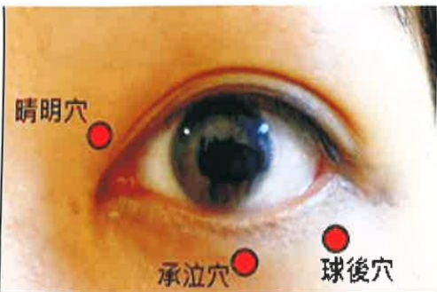

2. Slow down your pace of life, allow your eyes to rest more, and reduce exposure to strong light or flashing stimuli from television, smartphones, and other devices. Take a 10-minute break every 30 minutes when using a computer screen, television, or reading.

3. Avoid anger and anxiety; adjust your workload and eliminate the habit of staying up late to ensure sufficient sleep.

4. Ensure adequate hydration daily, and drink 150 c.c. of water after each acupuncture session.

## (Three) Eye Massage:

Use the first joint of both index fingers to massage the acupoints around the upper and lower orbital areas, such as Qingming, Qiu Hou, and Chengyi (as shown on the cover). Press each point ten times until a mild ache or heaviness is felt; avoid directly pressing on the eyeball or applying excessive force.

## Seven. References

Hsu Si-han, Chen Hsiao-kuei, and Kuo Yu-wei (2019). "A Case Report on the Treatment of Low-IOP Glaucoma with Eye Acupuncture for Visual Field Defects." *Journal of the Chinese Acupuncture Society*, 22(3-4), 29–44. Hsu Si-han, Wong Wei-yang, Lai Ying-hsiu, Qiu Ying-sheng, and Kuo Yu-wei (2020). "A Case Report on Iris Inflammation-Type Glaucoma Treated with Traditional Chinese Acupuncture." *Journal of Integrated Chinese and Western Medicine*, 22(1), 42–56.

Yi Da Hospital  
Address: No. 1, Yida Road, Jiaosu Village, Yanchao District, Kaohsiung City  
Phone: 07-6150011  

Yi Da Cancer Treatment Hospital  
Address: No. 21, Yida Road, Jiaosu Village, Yanchao District, Kaohsiung City  
Phone: 07-6150022  

Yi Da Da Chang Hospital  
Address: No. 305, Dachang Road, Saming District, Kaohsiung City  
Phone: 07-5599123  

This copyright is not allowed to be reproduced, reprinted, or resold without the consent of the copyright holder.

Copyright Holder: Yi Da Medical Foundation  

29.7×20 cm, Printed in January 2025, Revised in July 2024, HA-8-0028(3)

## To See Far Away, the Path of Traditional Chinese Health Care

## One: What is "Eye Acupuncture"?

"Eye acupuncture" is a therapy that uses specially designed, extremely fine and soft needles to stimulate acupoints such as Qingming and Qiushu around the orbital area. The needles penetrate through the soft tissue gap between the orbit and the eyeball, reaching the nerve sheaths. This helps improve blood circulation in the eyes, supports the repair and regulation of the optic nerve, and adjusts the surrounding muscle tissues of the eyes, thereby preventing vision deterioration.

## Two: Indications for "Eye Acupuncture"

Through localized eye acupuncture treatment, the therapy can simultaneously regulate the muscles, blood vessels, nerves, meridians, and qi flow in the eye area. It has therapeutic effects on various eye diseases such as glaucoma, retinal detachment, macular degeneration, amblyopia, optic nerve atrophy, high myopia, and dry eye syndrome.

## Three: "Eye Acupuncture" Technique

The practitioner uses specially designed needles, inserting them vertically into the skin, then gently guiding the needle tip into the back of the eyeball in a slight arc. During the process of insertion from shallow to deep, patients may feel a local sensation of numbness, heaviness, or tingling. Subsequently, a deep sensation of numbness and heaviness in the orbital area and behind the eyeball will spread to the top of the head or the back of the neck—this is known as "Qi reaching," indicating that the meridians inside and outside the eye are being unblocked and activated.

## Four: Safety of "Eye Acupuncture"

"Eye acupuncture" is similar to acupuncture at other body acupoints. However, since there are dense micro-vessels around the eyeball, excessive tension during needle insertion, frequent blinking or eye movement during retention, or improper handling may increase the risk of bleeding. Individuals with certain conditions such as advanced age, high sensitivity to pain, liver cirrhosis, thrombocytopenia, kidney dialysis, or those with abnormal coagulation function (such as those taking anticoagulant medications) or those with a strong fear of acupuncture should avoid this therapy.

## Five: Handling Bleeding in "Eye Acupuncture"

To reduce the risk of bleeding, the needle tips have been modified from sharp to rounded. For mild cases, only bruising around the orbital area and eyelids may appear—similar to shadows or "panda eyes" (as shown in Figure 1). A small number of individuals with special body types or vascular structures may develop orbital hematomas, eyelid swelling and drooping, or a sensation of swelling inside the orbit. These symptoms may make it difficult to open the eyes for one to two days. After applying cold compresses and taking anti-inflammatory medication, vision is generally unaffected. After needle removal, the acupoint should be pressed firmly for about 3–5 minutes to prevent and reduce bleeding. If bleeding or bruising persists, immediate cold compresses should be applied around the eyes, and pressure on the eyeball should be avoided. If bruising or swelling appears gradually after leaving the clinic, self-application of cold compresses should be done within 72 hours, with a 30-minute rest every 15–20 minutes to prevent frostbite. After 72 hours, heat application can be used to promote absorption of the bruised blood. Hematomas typically significantly reduce and disappear within one to two weeks.

(Figure 1)

## Six: Prevention and Health Care

## (1) Diet:

1. Avoid spicy foods, alcohol, strong tea, and coffee, which may raise intraocular pressure.

2. Beta-carotene breaks down into vitamin A, which helps prevent night blindness and dry eye syndrome. Foods rich in beta-carotene include carrots, spinach, romaine lettuce, parsley, cabbage, pumpkin, sweet potatoes, and broccoli.

3. Vitamin C: Acts as an antioxidant, protects the retina from UV damage, prevents lens aging, strengthens the elasticity of small blood vessels in the eye, repairs cells, and supports eye health. Sources include papaya, kiwi, oranges, grapefruit, bell peppers, and strawberries.

4. Anthocyanins: Promote the growth of retinal rhodopsin, stabilize micro-vessels in the eyes, enhance microvascular circulation, and act as a strong antioxidant to reduce free radical damage, helping prevent cataracts and macular degeneration. Sources include blueberries, blackberries, cherries, purple cabbage, eggplants, and red grapes.

5. Among the xanthophylls, only lutein and zeaxanthin are present in the retina, helping block harmful blue light and protect the macula from damage. Foods rich in these include spinach, broccoli, parsley, onions, asparagus, corn, pumpkin, oranges, and bok choy.

## (2) Daily Lifestyle Tips:

1. After acupuncture, avoid running, heavy exercise, lying on the back, constipation, lifting heavy objects, bending over, or forcefully blowing or coughing, as these actions may increase intraocular pressure.