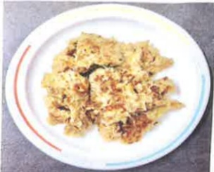

## ★ Stir-fried Chicken with Green Peppers

## 【Ingredients】

Chicken breast 350g, green pepper 100g, ginger paste 1/2 tsp, soy paste 1 tbsp, rice wine 1 tsp, cornstarch 1 tbsp, white pepper powder a pinch, salt to taste, salad oil as needed.

## 【Method】

1. Cut the chicken into large cubes and mix with ginger paste, rice wine, and soy paste.

2. Add 1 tbsp cornstarch and mix well.

3. Heat oil in a pan and sear the chicken on both sides until browned.

4. Add green peppers cut into julienne strips, pour in 1–2 tbsp water, cover and steam for about 3–5 minutes. (The softness of the green peppers will vary depending on the steaming time; adjust according to preference).

5. After steaming, season with a little salt and white pepper, and serve immediately.

## ★ Pumpkin Pancakes

## 【Ingredients】

Pumpkin 1 piece, carrot 2 pieces, eggs 3, green onions 2 stalks, all-purpose flour 1/4 cup, sweet potato flour 1 tsp, salt 1 tsp, white pepper powder 1 tsp, salad oil as needed.

## 【Method】

1. Peel and shred the pumpkin and carrots, set aside.

2. Add chopped green onions and eggs.

3. Season with 1 tsp salt and 1 tsp white pepper powder.

4. Add all-purpose flour and sweet potato flour, mix thoroughly. Set aside the prepared vegetable mixture.

5. Heat a non-stick pan and lightly coat it with oil. Use a spoon to pour the prepared vegetable mixture into the pan, and spread it evenly with a spatula.

6. Cook until golden brown on one side, flip over and continue cooking until the pancake is fully cooked. Serve when ready.