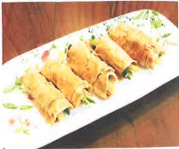

## (Eleven) Constipation

## ★ Dietary Principles and Improvement Methods:

1. Choose high-fiber foods such as vegetables, fruits, and whole grains.

2. Drink sufficient water or liquid foods.

3. Keep a relaxed mindset, engage in moderate physical activity, and develop a good bowel habit.

## ★ Fermented Tofu Skin with Fresh Vegetables Roll

## 【Ingredients】

Tofu skin: 3 pieces, Green beans: 9–12 pieces, Carrot: half a root, Tapioca starch: a little, Salt: a little, Soy sauce: as needed, Salad oil: as needed.

## 【Preparation Method】

1. Cut the carrot into strips; stir-fry the carrot with a little oil, then season with a little salt.

2. Cut the green beans into appropriate lengths, blanch them, then remove and set aside.

3. One piece of tofu skin can wrap four rolls. Spread the tofu skin flat, place three green beans and a little carrot inside, roll it up (half of the tofu skin after cutting horizontally), and seal the edge with a little tapioca starch.

4. Heat a little oil, place the sealed edge down toward the bottom of the pan, and fry until slightly golden. Add an appropriate amount of soy sauce and water, bring to a boil, and cook until fully cooked.