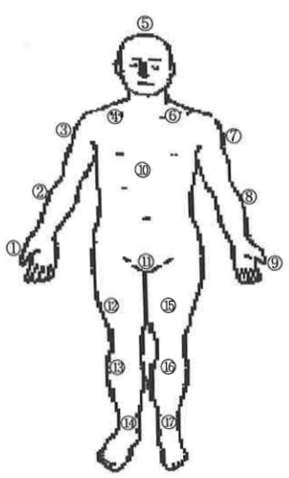

## VII. How to Record My Pain

To help medical and nursing staff better understand the changes in your pain, so that your pain can be better managed, please use the "Pain Assessment Record" in this handbook to carefully document your daily pain levels, serving as a reference for medical and nursing staff.

The "Pain Assessment Record" is filled out in two steps:

Step 1: Pain Location

Refer to the pain location diagram (Figure 1) to mark the location of your pain.

