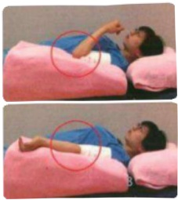
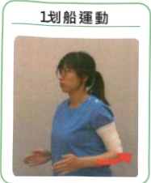

## Postoperative Phase One Rehabilitation

● Applicable timing: First week after surgery

Objective: Promote lymphatic return in the arm, reduce swelling.

Prevent postoperative lymphedema and restricted movement, which may affect daily life.

1 Fist clench and open

2. Wrist movements

3. Elbow movements

## Postoperative Phase One Rehabilitation

Applicable timing: First week after surgery

Objective: Prevent restricted shoulder and arm movement.

Notes: Avoid excessive pulling on the wound.

Follow the video and move along

Shoulder flexion and abduction ≤ 90 degrees.

1 Rowing exercise

2. Light patting hand exercise

3. Forward elevation exercise

4. Lateral elevation exercise

Elbow should not be raised above shoulder level  
Way above the shoulder!!!