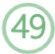
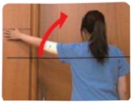
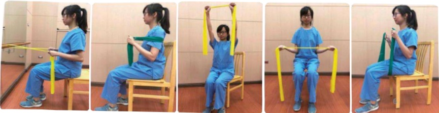

## Postoperative Passport

## Rehabilitation Exercises

## Second Phase of Postoperative Rehabilitation

☑ Applicable Timing: Week 2 after surgery, can be gradually progressed to week 4.

☑ Purpose: Prevent restricted shoulder and arm movement, aiming to return to pre-surgical range of motion.

1. Wall Climbing Exercise (Front View)

Shoulder Movement

2. Wall Climbing Exercise (Side View)

Follow the video and move along

3. Chest Expansion Exercise

4. Upper Back Stretching Exercise

5. Lower Back Scratching Exercise

Third Phase of Postoperative Rehabilitation

Applicable Timing: After surgical wound healing

Purpose: Gradually enhance muscle strength to return to daily life or work.

