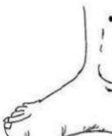

## Acupuncture Recommendations in Traditional Chinese Medicine

<Treatment for nausea, vomiting, and poor appetite>

Nausea, vomiting, and loss of appetite may occur due to various treatments. These acupuncture points can be used if there are no contraindications.

## Zusanli, Shangjuxu, Xiaojuxu

**Location**: Three cun below the outer knee eye. Zusanli is one cun lateral to the outer edge of the tibia. Shangjuxu is three cun below Zusanli, and Xiaojuxu is three cun below Shangjuxu.

**Indications**: Constipation, diarrhea, digestive disorders, nausea, vomiting, abdominal distension.

**Procedure**: Press and stimulate the acupuncture points.

## Neiguan

**Location**: Two cun above the transverse wrist crease on the inner side of the forearm, between the two central tendons.

**Indications**: Gastric pain, vomiting, palpitations, chest pain, insomnia.

**Procedure**: Press and stimulate the acupuncture points.

## Acupuncture Points for Chemotherapy Patients with Sleep Disorders

Chemotherapy patients often experience sleep disturbances due to psychological factors or medication side effects. The following two points can help calm the mind and improve sleep. They can be used by pressing the points, suitable for home care.

## Sanyinjiao

**Location**: Three cun above the inner ankle, in the depression along the posterior edge of the tibia.

**Indications**: Poor sleep, gynecological disorders, spleen and stomach deficiency.

**Procedure**: Press and stimulate the acupuncture points.

