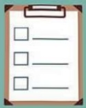

84

## Psychological Adaptation

The National Comprehensive Cancer Network (NCCN) provides seven recommendations for cancer patients to begin improving their fatigue issues by adjusting their lifestyle.

Try to remain physically active; walking is particularly suitable for cancer patients, and it's even better if you can develop a habit.

Take timely breaks, but avoid overdoing it—for example, a nap of less than 30 minutes is a good option.

Conserve energy and ensure that the most important daily tasks are prioritized.

1

2

3

7 secrets to overcoming "hysterical warts syndrome"

If needed, don't forget that family and friends are always ready to offer support.

4

If fatigue does not improve, communicate your concerns to your treatment team. Use relaxation techniques, counseling, and stress management training to combat stress.

Adopt a healthy diet and drink plenty of water.

7

...

6

5

