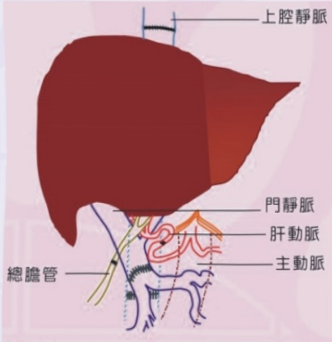
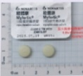

## Introduction

According to the current data released by the Ministry of Health and Welfare, the one-year survival rate after liver transplantation is 93%, and the five-year survival rate is 75%. Before you proceed with the transplantation surgery, we hope this leaflet will help you fully understand the surgical process, risks, and post-operative care considerations, and serve as a reference for discussions with your physician.

## Section I: Surgical Procedure

Liver transplantation is a lengthy and complex surgery. First, the diseased liver (including the gallbladder) is removed, followed by the implantation of the donated liver. During the procedure, the superior vena cava, portal vein, hepatic artery, and bile duct of the donated liver are surgically connected to the corresponding structures in the recipient. The surgery typically lasts between 8 to 12 hours.

## Section II: Surgical Risks

Medical institutions and healthcare professionals will do their best to treat and perform the surgery, but surgery is not guaranteed to succeed. Complications or even death may still occur. Possible risks associated with the surgery include:

## (1) General surgical risks

(1) A small portion of the lungs may collapse and lose function, increasing the risk of chest infections. In such cases, antibiotics and respiratory therapy may be required.

(2) Blood clots may form in the legs, causing pain and swelling. If the clots dislodge and travel to the lungs, they can lead to a life-threatening condition—though this is relatively rare.

(3) The heart may be under increased pressure, potentially leading to a heart attack or stroke.

## (2) Complications that may occur during or after liver transplantation:

(1) Bleeding.

(2) Poor cardiac and pulmonary function, as well as other rare complications.

(3) Pleural effusion, ascites.

(4) Gastrointestinal damage, poor intestinal motility leading to bloating or intestinal adhesion causing intestinal obstruction.

(5) Intra-abdominal infection, wound infection, or poor wound healing.

(6) Bile duct obstruction or bile leakage.

(7) Abnormal liver function post-transplantation, which may lead to liver failure—severe cases may require a second liver transplant.

The above are possible complications that may occur during or after liver transplantation. Patients who already have chronic diseases (such as hypertension, diabetes, heart disease, etc.), have severely impaired liver function, have a history of smoking, or are older are at a higher risk of developing complications.

## Section III: Immunosuppressive Medications After Transplantation

Patients must take immunosuppressive medications for life after liver transplantation. These drugs suppress the immune system and may therefore bring about certain side effects.

<table border=1 style='margin: auto; width: max-content;'>
<tr>
<td style='text-align: center;'>Tacrolimus (FK506), available in three forms: Prograf (short-acting) and Astemizole (long-acting), with dosages of 0.5mg/cap, 1mg/cap, and 5mg/cap</td>
<td style='text-align: center;'>

</td>
</tr>
<tr>
<td style='text-align: center;'>Mycophenolate mofetil (Mycophenolate acid; Cellcept/Mycophenolate acid; Myfortic): Cellcept is 250mg/cap; Myfortic is 180mg/tab</td>
<td style='text-align: center;'>

</td>
</tr>
<tr>
<td style='text-align: center;'>Prednisolone (Lerushang tablets) at 5mg/tab, used for 3 to 6 months</td>
<td style='text-align: center;'>

</td>
</tr>
<tr>
<td style='text-align: center;'>Basiliximab (Simulect) injection, 20mg/vial; this is a non-covered item under the national health insurance scheme</td>
<td style='text-align: center;'>

</td>
</tr>
</table>