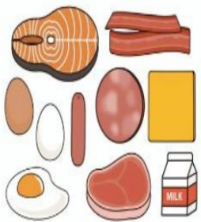

### 4. Radiation Therapy Care Guidelines for Esophageal Cancer

## (1) Definitions

a. Esophageal cancer is cancer occurring in the esophagus. The esophagus is a tube that transports food from the mouth to the stomach.

b. Radiation therapy: A method that uses high-energy radiation to eliminate tumors; also known as radiotherapy.

## (2) Applicable Population

Patients with esophageal cancer undergoing radiation therapy.

## (3) Care Methods and Precautions

|  |  |  |
|---|---|---|
| Choose soft, comfortable clothing and avoid garments with collars. |  |  |
| When securing dressings, use bandages or gauze; avoid direct adhesive tape application on the body. |  |  |
| Dietary intake should include high-calorie, high-protein foods to prevent weight loss. |  |  |
|  |  | ↓ |

