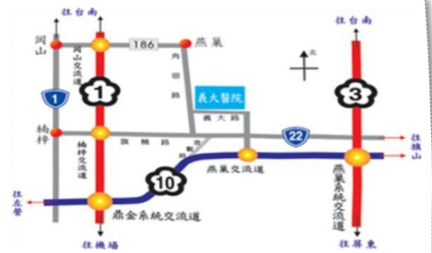

## CT Scan with Intravenous Contrast

1. If you have diabetes, the examination includes coronary artery angiography (with contrast), abdominal or head CT (with contrast). You must stop taking diabetes medications (e.g., metformin, such as Furosemide tablets, Meirpan tablets, Gaosyuan tablets, Aitomide tablets) two days before and two days after the examination. Please discuss with your doctor whether to discontinue these medications, as failure to do so may affect the examination.

Coronary CT

2. You can download the "YiDa Medical Contrast Agent Clear" app to review relevant precautions regarding contrast agents.

Magnetic Resonance Imaging

## Warm Reminders

1. If you have selected "pain-free" anesthesia for the examination, please avoid applying colored nail polish (including light therapy or crystal nails). On the day of the examination, do not wear earrings, necklaces, rings, or contact lenses. Avoid wearing one-piece underwear or one-piece pantyhose. Please do not bring valuable items.

2. To facilitate female patients, you may wear sports-style underwear without underwire for the examination.

3. During menstruation, please avoid fecal, urine, and smear tests. You may submit these samples to the health check center within 7 days after the examination. If pregnancy is possible, please postpone or avoid X-ray examinations.

4. It is recommended that women over 30 years old with sexual activity undergo a cervical smear test annually as advised by the National Health Agency. If cervical ultrasound is included in the examination, it must be scheduled after a full bladder is achieved.

## VIP Exclusive Offers

1. The parking fee is charged at the emergency department of YiDa Hospital. If you are parking on the day of the examination, please contact the health check center staff to obtain a parking exemption voucher, which can then be presented to the parking officer to waive the parking fee.

2. In appreciation of our existing VIPs' support and loyalty, we are offering the "Return Visit VIP Special Benefits." If you bring the health check garment provided by our center, you may choose one free blood test item. Please inquire about the details at the counter on the day of your health check.

## Other Information

1. If you need to change your examination date or add additional examination items, please contact us at least 3 days in advance to facilitate scheduling changes and reduce waiting time.

2. Payment methods: Cash or credit card (only VISA, MasterCard, and JCB cards are accepted). American Express cards are not accepted.

☑ Health Check Center Consultation Phone: (07)615-0011 ext. 5705, 5707, 5713, 5712, 5688

☑ Health Check Service Hours:

Monday to Friday: 08:00–17:00  
Saturday: 08:00–12:00

☑ On-site Transportation Route Map:

YiDa Medical Foundation 21×29.7cm 2024.07 Printed

