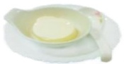

Precautions before Gastroscopy

Fluid intake

More than 2000 c.c. per day

## Low-residue diet

## Two days before the examination

Rice porridge

Noodles

Skinless fish meat

Sports drink

## Meal replacement

## [Easy-to-brew meal sets]

One packet for breakfast, lunch, and dinner

Add one packet to 500 c.c. hot water and stir evenly

Fluid intake

Can be consumed after standing still for 10 minutes

## Use of bowel preparation solution

Meat broth

Bowel preparation health education animation (Mandarin)

One day before the examination

Toast

During the week before the examination, drink at least 2000 c.c. of fluids daily

Avoid eating vegetables, fruits, dairy products, and fried foods

Please confirm whether the stool sample has been collected before health check-up

Interval of 1 hour

Fluid intake: 2000 c.c.

Fasting

First bottle + 250 c.c. water diluted

Steamed egg

Manduan (steamed bun)

Bowel preparation health education animation (Taiwanese)

Heat directly in microwave or heat in water bath

#### More than 2000 c.c. per day

Breakfast: one manduan

Lunch: two packets / Dinner: one packet

Medication reminder app (Android)

Medication reminder (iOS)

On the day of examination

05:00 Fasting

Interval of 30 minutes

Try to sit on the toilet to promote bowel movement; use a stool pad to raise the toilet seat for easier defecation

Second dose + 250 c.c. water diluted

Fluid intake: 750 c.c.

Walk around and massage your abdomen; use warm water to wash the anal area to stimulate bowel movements. During the process, you may have several bowel movements. Use warm water to clean to reduce wiping the anal opening.

## Warm reminders

The laxative starts working after drinking; continuously observe the state of the stool fluid [as shown in the left image]. Please take a photo of your last bowel movement using your smartphone to help the nursing staff evaluate.