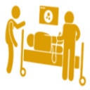

Precautions before gastroscopy examination

Fluid intake

More than 2000 c.c. per day

## Low-residue diet

## Two days before the examination

Rice porridge

Noodles

Skinless fish meat

Sports drink

## [Easy-to-prepare meal sets]

Fluid intake

One packet can be consumed for breakfast, lunch, and dinner

Bone broth

Add one packet to 500 c.c. hot water and stir evenly

Allow to stand for 10 minutes before consumption

## Use of bowel preparation solution

Bowel preparation educational animation (Mandarin version)

One day before the examination

>

Interval of 1 hour

Fasting

Take the entire packet plus 2000 c.c. of water, mix well, and take 1000 c.c. first

Hydration: 2000 c.c. per day

Drink at least 2000 c.c. of water daily during the week before the examination

Toast

Avoid eating vegetables, fruits, dairy products, and fried foods

Confirm whether stool sample has been collected prior to health check

Try to sit on the toilet to promote bowel movement; use a stool pad to elevate the toilet seat to facilitate defecation

Mandarin bun

Steamed egg

#### More than 2000 c.c. per day

Breakfast: one mandarin bun

Heat directly in microwave or water bath

Bowel preparation educational animation (Taiwanese version)

Medication reminder app (Android)

Medication reminder (iOS)

On the day of the examination

05:00 Fasting

Drink the remaining 1000 c.c. of the solution

No additional hydration needed

Move around and massage your abdomen; use warm water to wash the anal area to stimulate bowel movements. You may have several bowel movements during this period. Use warm water to clean the anal area to reduce wiping.

## Warm reminders

The bowel preparation solution starts working after drinking it. Please continuously observe the state of the stool (as shown in the left image). Take a photo of your last bowel movement using your smartphone to help the medical staff evaluate your condition.