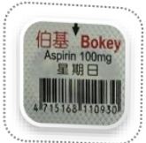
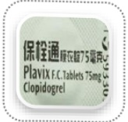
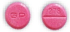
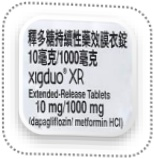

## Anti-hyperglycemic drugs

## Cilostazol (Pletaal)

## Clopidogrel (Plavix) 75mg/tab

## Shutuan Ning coated tablet

## Dipyridamole

## 25 mg/tab

## Dapagliflozin and Metformin (Xigduo XR)

Metformin 1000mg/tab

## Warfarin (Cofarin) (Mafarin)

## Glimepiride and Metformin (Glimet)

Likongtang coated tablet

## Metformin (Ankomin)

## Sitagliptin and Metformin (Janumet)

+ Metformin 500mg/tab

## Vildagliptin and Metformin (Galvus Met)

## For long-term medications, please continue taking them as instructed by your doctor and do not stop taking them. However, for diabetes medications, please refrain from taking them on the morning of the examination day, and carry your medication with you to the health check-up center.

For patients taking antiplatelet, anticoagulant drugs, ginkgo biloba, natto, fish oil, Q10, and other medications, please consult your doctor to evaluate the feasibility of discontinuing these medications for 7 days to reduce the risk of post-surgical bleeding during polypectomy.