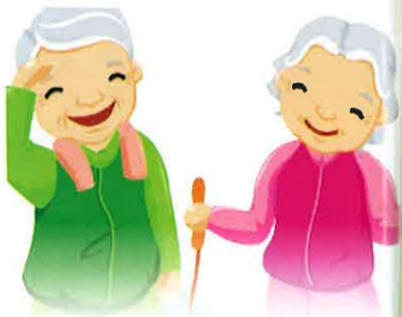

## Osteoporosis

## I. What is "osteoporosis"?

After birth, bone density increases and reaches its peak around ages 20 to 30. After that, bone density gradually decreases. In women, the rate of bone loss accelerates after menopause. If bone loss becomes excessive, the originally dense bones develop numerous pores, resulting in a hollow and porous condition—this is known as "osteoporosis."

## II. Clinical Symptoms of Osteoporosis?

Due to bone thinning and fragility, bones become prone to fractures, especially in the forearm, femur, and vertebrae. A noticeable symptom is vertebral compression fractures, which cause back pain, reduced height, and a hunched posture. Patients typically seek medical help due to sudden, severe pain from fractures. In more severe cases, multiple vertebral fractures lead to further height reduction, a pronounced hunched back, and widespread chronic back pain. If the spine becomes severely curved, breathing difficulties may occur.

## III. Risk Factors for Osteoporosis

Risk factors can be divided into two categories: "uncontrollable factors" and "controllable factors."

## 1. Uncontrollable Factors

(1) Female gender  
(2) Menopause or cessation of menstruation  
(3) Age over 70 years  
(4) Family history of osteoporosis  
(5) Short stature and small body frame

## 2. Controllable Factors

(1) Inadequate calcium intake  
(2) Smoking  
(3) Excessive alcohol consumption  
(4) Lack of physical activity  
(5) Consuming large amounts of coffee

## IV. Prevention Methods for Osteoporosis

## 1. Increase Calcium Intake

Once bone loss has occurred, it is very difficult to fully recover. Therefore, early prevention to build strong bones is essential. Effective methods include increasing calcium intake. Sources of calcium:

(1) Milk and dairy products: Milk is rich in calcium and easily absorbed by the human body. Other dairy products such as cheese and yogurt also contain high levels of calcium.

(2) Other calcium-rich foods: Small fish, fish jerky, shrimp, and oysters. Additionally, when making bone broth, adding vinegar helps release calcium from bones.

(3) Calcium supplements: Calcium is best obtained from food. If it is impossible to obtain sufficient calcium through diet, calcium supplements can be taken. However, the following points should be noted:

1. Do not exceed 500–600 mg per dose, and do not exceed 1500 mg per day.

2. Take vitamin D simultaneously or consume a small amount of milk to enhance calcium absorption.

3. If calcium supplements cause gas or constipation, drink more water before taking them or take them with meals.

4. Do not take calcium supplements within 1–2 hours of taking other medications.

## 2. Appropriate Exercise

Moderate outdoor activities are essential because sunlight helps the body produce vitamin D, which enhances intestinal calcium absorption. Consistent and moderate exercise can prevent osteoporosis, improve sleep, and maintain vitality. Choose suitable exercises and avoid activities involving collisions or sudden movements to reduce the risk of falling.

## 3. Prevent Falls

Patients diagnosed with osteoporosis must take measures to prevent falls to avoid fractures. 

