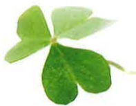
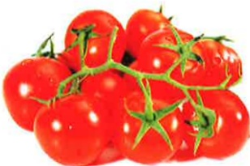

## V. Diagnosis of Diabetes

The diagnosis of diabetes is primarily based on blood glucose levels. According to the diagnostic criteria published by the American Diabetes Association in 2011, the following apply:

1. HbA1C ≥ 6.5%.

2. Fasting blood glucose ≥ 126 mg/dL after an 8-hour fast, or 2-hour postprandial glucose ≥ 200 mg/dL following an oral glucose tolerance test.

3. Presence of typical symptoms of hyperglycemia or hyperglycemic crisis, with a random blood glucose level ≥ 200 mg/dL, which can be used to diagnose diabetes.

## VI. Treatment of Diabetes

1. Patients with Type 1 diabetes:

The current treatment involves lifelong insulin therapy to control blood glucose levels.

2. Patients with Type 2 diabetes:

The first step in treatment is healthy dietary habits and appropriate physical activity. If blood glucose levels still fail to reach the target, oral hypoglycemic agents may be initiated.

## VII. Symptoms of Hypoglycemia

Hypoglycemia refers to blood glucose levels below 70 mg/dL. It is typically accompanied by symptoms such as hunger, dizziness, cold sweats, tachycardia, and weakness. If a patient becomes aware of hypoglycemia and is conscious, they should immediately consume half a cup (120–180 c.c.) of fruit juice, one tablespoon of honey, or 3–4 pieces of sugar. If symptoms do not subside after 15 minutes, the treatment should be repeated. If symptoms persist without improvement, medical help should be sought immediately.

## Diabetes Diet

1. Eat at regular intervals and in fixed portions: to maintain stable blood glucose levels.

2. Maintain an ideal body weight: obesity increases insulin resistance.

3. Balanced intake of the six major food groups:

   a. Dairy: low-fat milk, skim milk, cheese, etc.

   b. Staple foods: rice, buns, noodles, sweet potatoes, corn, red beans, green beans, etc.

   c. Meat, fish, beans, and eggs: chicken, duck, beef, lamb, pork, tofu, eggs, etc.

   d. Vegetables: dark green, light green vegetables, leafy greens, gourds, mushrooms, etc.

   e. Fruits: various fresh fruits such as oranges, bananas, papaya, and pomelos, etc.

   f. Fats: cooking oils, nuts such as peanuts, cashews, and sunflower seeds, etc.

4. Increase dietary fiber intake:

   a. Fiber:

      (1) Prevents rapid postprandial blood glucose spikes.

      (2) Increases satiety.

      (3) Prevents constipation.

   b. Sources: vegetables, tomatoes, whole grains, etc.

   c. Prevents rapid postprandial blood glucose spikes.

5. Use low-fat cooking methods: prefer steaming, boiling, braising, stewing, roasting, or stir-frying.

6. Reduce total fat intake:

   a. Avoid animal skin: fatty meat, pork skin, duck skin, chicken skin, fish skin, etc.

   b. Avoid fatty meats, five-layer pork, chicken wings, etc.

   c. Avoid fried, pan-fried, deep-fried, or oil-based dishes such as oiled dishes, thick soups, etc.

   d. Avoid nuts such as peanuts, cashews, sunflower seeds, and almonds.

   e. Strictly avoid alcohol.

## VIII. Reduce intake of high-cholesterol foods:

For example, brain, liver, internal organs, testes, crab roe, shrimp roe, fish roe, and egg yolks, etc.