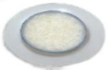
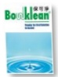

## Do not swallow powder directly to avoid esophageal burns

## Meal replacement diet

Precautions before gastrointestinal endoscopy

Fluid intake

More than 2000 c.c. per day

## Low-residue diet

Rice porridge

## Two days before the examination

Noodles

Skinless fish meat

Sports drink

Broth

Fluid intake

Toast

## [Easy-to-brew meal options]

One packet per breakfast, lunch, and dinner

Add one packet to 500 c.c. hot water and stir evenly

Allow to stand for 10 minutes before consumption

## Bowel preparation

Bowel preparation educational animation (Mandarin version)

One day before the examination

Confirm that stool specimen has been collected prior to health check

Avoid eating vegetables, fruits, dairy products, and fried foods

Drink at least 2000 c.c. of water daily during the week before examination

#### More than 2000 c.c. per day

Steamed egg

Breakfast: one bun

Bun

Lunch: two packets / Dinner: one packet

Heat directly in microwave or water bath

Bowel preparation educational animation (Taiwanese version)

Medication reminder app (Android)

Medication reminder (iOS)

Fasting

On the day of examination

Interval of 1 hour

05:00 Fasting

Interval of 30 minutes

First dose + 150 c.c. water diluted

Hydration: 2000 c.c.

Second dose + 150 c.c. water diluted

Hydration: 750 c.c.

## Warm reminders

Try to sit on the toilet to promote bowel movement; use a stool pad to elevate the toilet seat for easier defecation

Move around and massage your abdomen regularly; use warm water to rinse the anal area to stimulate bowel movements, which may result in several bowel movements during the process; use warm water to clean the area

Reduce wiping around the anal opening

The laxative starts working after drinking it; continuously observe the stool condition [as shown in the left image]

Take a photo of your last bowel movement using your smartphone to help healthcare staff evaluate the situation