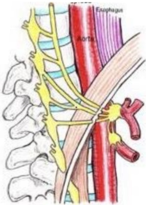

## Understanding Visceral Nerve Ablation

Visceral nerve ablation is an effective treatment for chronic severe abdominal pain and upper abdominal pain from malignant tumors. This therapy is particularly beneficial for patients whose pain does not improve after using strong analgesics or who have tried various conservative treatments. It is also an ideal choice for patients who do not respond to medication, suffer intolerable side effects from drugs, or are unable to use analgesics.

## What are visceral nerves?

Visceral nerves are located on both sides of the thoracic vertebrae and consist of sympathetic and sensory nerves. Sensory information from abdominal organs—such as pain—is transmitted via visceral nerves to the central nervous system. Organs that transmit signals through visceral nerves include: stomach, spleen, liver, biliary ducts, gallbladder, pancreas, renal pelvis, adrenal glands, small intestine, ascending colon, and part of the transverse colon.

## What is visceral nerve ablation?

Visceral nerve ablation involves using high-frequency thermal coagulation to destroy visceral nerves, thereby preventing pain signals from abdominal organs from being transmitted via visceral nerves to the brain, thus reducing the patient's upper abdominal pain. During visceral nerve ablation, the patient lies in a supine position. Under X-ray guidance, a needle is inserted beside the 11th/12th thoracic vertebrae. Once the correct position is confirmed, high-frequency thermal coagulation is performed.

