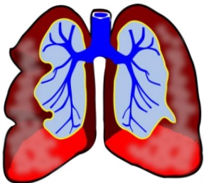

## How effective is visceral nerve block?

Most patients experience pain relief, reduced need for pain medication, and improved quality of life after treatment. Pain relief can last from three to six months or longer, although the duration varies depending on the condition. If pain recurs, the procedure can be repeated.

## Indications for visceral nerve block

Upper abdominal pain caused by malignant tumors is the most common indication. Upper abdominal pain due to chronic pancreatitis can also be considered for visceral nerve block treatment.

## Precautions for visceral nerve block

1. Hypotension: Rare; usually managed with intravenous fluid infusion.  
2. Diarrhea: Rare; generally controllable.  
3. Pneumothorax: Rare; occurs due to the proximity of the nerve anatomy to the lung; requires observation for 12 hours.

With advances in medical technology, cancer pain management has become increasingly diverse. In addition to conventional pharmacological treatments, image-guided nerve blocks can now be used to provide personalized pain relief therapies for patients. This not only effectively alleviates cancer pain but also improves overall quality of life.

|  | Contact Information |
|---|---|
| **Yi Da Hospital Pain Department** Address: No. 1, Yida Road, Jiaosu Village, Yancheng District, Kaohsiung Phone: 07-6150011 | **Yi Da Cancer Treatment Hospital Pain Department** Address: No. 21, Yida Road, Jiaosu Village, Yancheng District, Kaohsiung Phone: 07-6150022 |
| Copyright owner: Yi Da Medical Foundation Prohibited from reprinting or reselling without permission Size: 21×29.7 cm | Copyright owner: Yi Da Medical Foundation Document No.: HA-9-0097(1) Date: July 2020 |