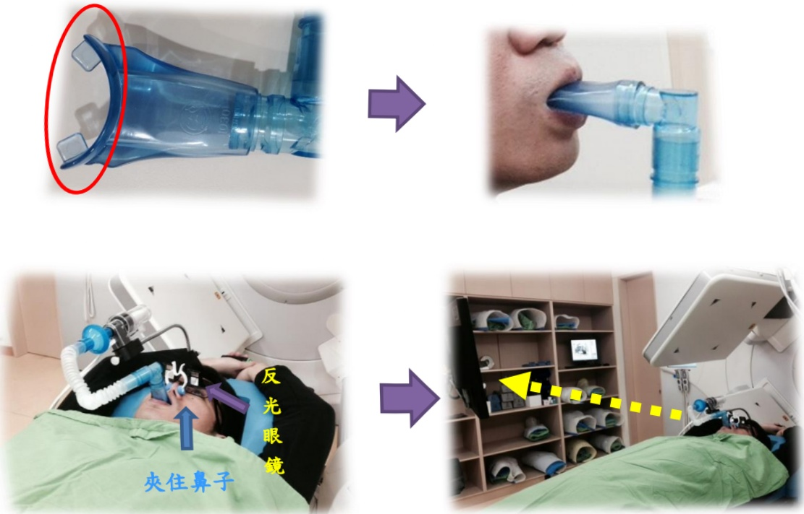

## Understanding Active Breathing Control

Objective:

During breathing, organs in the chest and abdomen move within the body as they expand and contract. By inhaling fully and then holding the breath, the following can be achieved: (1) reduce errors in the treatment area caused by breathing, thereby improving treatment accuracy; (2) when fully inhaling, the lung volume increases, which reduces the irradiated area of the lungs and moves the chest wall away from the heart, thus decreasing the radiation dose received by the lungs and heart, and reducing side effects to the lungs and heart.

Hold the breathing tube at the front end with your mouth, perform lung breathing, and do not use abdominal breathing. Use a nose clip to restrict nasal breathing. Wear a reflective eyeglass and adjust the viewing angle so that you can see the time and breathing waveform displayed on the computer screen (as shown in the figure below).

Contact Information

Tzu Chi Cancer Hospital

Address: No. 21, Yida Road, Jiaosu Village, Yancheng District, Kaohsiung City

Phone: 07-6150022 ext. 6787, 6813