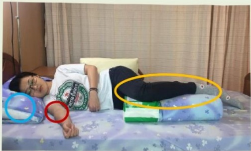

## Ten. Rehabilitation Exercise Therapy

# ◆ Positioning Precautions for Patients with Unilateral Weakness

### Purpose: 1. Prevent adverse postures such as pressure sores and joint contractures.

## Lying on Side ~ Affected Side Up ~

<table border=1 style='margin: auto; width: max-content;'>
<tr>
<td style='text-align: center;'>1. Head and neck: Use a pillow to elevate 2. Affected hand: Place it in front of the body     Elevate the hand with a pillow or blanket below     Elbow slightly bent, wrist extended, palm down 3. Affected leg: Flex forward     Place soft padding (e.g., blanket) under hip, knee, and ankle</td>
<td style='text-align: center;'></td>
</tr>
<tr>
<td colspan="2">Lying on Side ~ Affected Side Down ~</td>
</tr>
<tr>
<td style='text-align: center;'>1. Head and neck: Use a pillow to elevate 2. Trunk: Support behind the back and buttocks, body slightly reclined backward 3. Affected side: Hand placed in front of the body     Slightly pull the scapula forward, palm upward 4. Healthy leg: Flex forward     Place soft padding (e.g., blanket) under hip, knee, and ankle</td>
<td style='text-align: center;'></td>
</tr>
</table>

## Notes:

(1) Change position every two hours and check for pressure sores on the pressure-bearing side.

(2) If there is hydrocephalus, head surgery, or fracture site, adjust the position according to medical instructions.

(3) For patients using a respirator or urinary catheter, ensure that pulling does not occur.