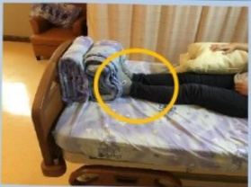

## Ten. Rehabilitation Exercise Therapy (Continued)

◆ Positioning precautions for patients with unilateral weakness – Benefits of sitting posture on bed: reduced pressure sores, sensory stimulation, impact on lung capacity

Make full use of the healthy side limb,  
to assist body movement!

Use the better hand to grasp the head of the bed or rail, and the better foot to press against the bed's back.  
Apply force simultaneously with both hands and feet to lift the body until the head touches the headboard.

O: Place a pillow under the affected side's elbow and forearm, palm down.  
☐: Place a cotton blanket or similar between the feet and the bed's tail.

☐: Press both feet against a rolled cotton blanket at the bed's tail.  
Keep both knees straight and the bed tail aligned to prevent the buttocks from sliding down.  

Method two:  
☐: Press both feet against a rolled cotton blanket at the bed's tail, then raise the bed tail to prevent the buttocks from sliding down.