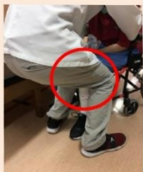

## Ten. Rehabilitation Exercise Therapy (Continued) ◆ Transfer Techniques for Patients with Unilateral Weakness

## Pre-transfer Preparation

Step 1: Angle the wheelchair and bed at approximately 30 degrees.

Mnemonic: The stronger limb should be closer to the destination.

Step 2: Engage the wheelchair brakes and ensure IV lines are not pulled.

Raise both footrests or externally rotate them,  
secure the urine bag and hang it on the patient.

Step 3: Move the patient's buttocks forward,

bend both knees to about 90 degrees,  
place both feet flat on the floor.

## Safety First! Seek assistance if necessary!

| Step 4: Transfer Method 1 | Transfer Method 2 |
|--------------------------|-------------------|
| For patients with one weak leg, the caregiver places one foot between the patient's two knees (front arch, back arrow). | Applicable to patients with one or both legs weak; the caregiver places both feet on the front edge of the patient's weak-side knees. |
|  Mnemonic:  If the patient's right leg is strong, the caregiver's right foot is in the middle |   |