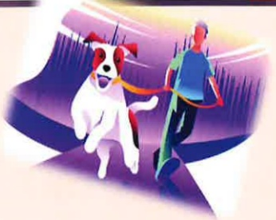

## Fatigue: Take Small Steps Forward

## Using Exercise to Alleviate Cancer-Related Fatigue

|  | Exercise Type | Exercise Intensity (Perceived) |
|---|---|---|
| Warm-up period 5–10 minutes | Slow walking | Perceived exertion < 8 (Very easy) |
| Training period 15–20 minutes | Moderate-speed walking | Perceived exertion ≤ 13 (A bit strenuous, still able to talk) |
| Cool-down period 5–10 minutes | Slow walking | Perceived exertion < 8 (Very easy) |

## Perceived Exertion Scale

During walking, please determine the exercise intensity based on your own perception.

| Number | Description |  |
|--------|-------------|---|
| 6 | No sensation of effort |  |
| 7 | Extremely easy |  |
| 8 | Very easy |  |
| 9 |  |  |
| 10 | Easy – can sing during training |  |
| 11 |  |  |
| 12 | A bit strenuous – can talk, cannot sing |  |
| 13 | Strenuous – talking becomes labored |  |
| 14 | Very strenuous – talking causes shortness of breath |  |
| 15 |  |  |
| 16 | Extremely strenuous – talking causes breathing difficulty |  |
| 17 | Super strenuous |  |
| 18 | Extremely strenuous |  |
| 19 |  |  |
| 20 | Already giving maximum effort |  |