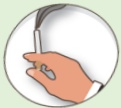

## COPD Pulmonary Exercise

## Upper Limb Exercises — Resistance Band Training

## What is COPD?

Chronic respiratory inflammation leading to irreversible obstructive disease

Eighth leading cause of death in Taiwan

Symptoms: Cough

Sputum

Shortness of breath

Risk factors:

Smoking or secondhand smoke

Exposure to environmental pollutants

Occupational exposure

Family history

Or other lung conditions

## Importance of Upper Limb Exercises

Improves upper limb muscle strength  
Enhances endurance and respiratory capacity  $ \leftrightarrow $  Reduces discomfort from shortness of breath

Consistent practice is essential!

Training frequency  
Three or more times per week  

Training duration  
At least 20–30 minutes per session  

$ ^{*} $ Recommended frequency and duration are for reference; adjust according to individual conditions  

References  
1. Taiwan Thoracic and Critical Care Society (2022) · "Run, Little Lung!" – COPD Pulmonary Rehabilitation Educational Handbook  
2. Taiwan Thoracic and Critical Care Society (2017) · "What is COPD?" – Comprehensive Care Handbook for COPD in Taiwan

| Contact Information |
|---------------------|
| Yida Hospital | Yida Cancer Treatment Hospital | Yida Dachang Hospital |
| Address: No. 1, Yida Road, Jiaosu Village, Yancheng District, Kaohsiung City | Address: No. 21, Yida Road, Jiaosu Village, Yancheng District, Kaohsiung City | Address: No. 305, Dachang 1st Road, Sanmin District, Kaohsiung City |
| Phone: 07-6150011 ext. 5072 (COPD Individual Care Specialist) | Phone: 07-6150022 ext. 6477 (COPD Individual Care Specialist) | Phone: 07-5599123 (Respiratory and Thoracic Clinic) |