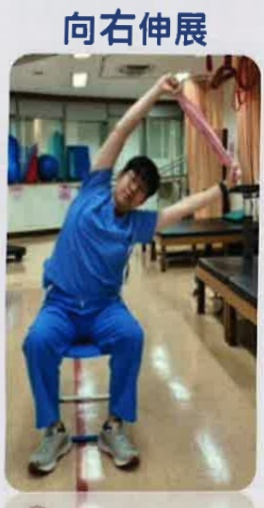

## Upper Body Upright and Chest-Expanding Exercises

Extend upward

## Hold Two Towels in Hands

Extend to the right

Extend to the left

Inhale for 2-3 seconds and exhale for 4-6 seconds when reaching the highest point.

Perform 10 repetitions per movement. Three movements constitute one set. Do at least three sets daily.

$ ^{*} $ The demonstration of exercise frequency and number of sets is for reference only and can be adjusted according to individual conditions. $ ^{*} $

## Face a Wall, Step Back with a Large Step

Stand with feet shoulder-width apart and hands supporting the wall.

Extend the chest toward the ground and hold for 5~10 seconds.

Perform 10 repetitions each time. Do at least three times daily.

Yi Da Medical Center, Respiratory and Thoracic Department