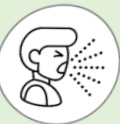
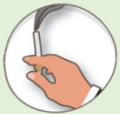

# COPD Pulmonary Exercise Training

## Grip Strength Training

## What is COPD?

## Chronic respiratory inflammation, an irreversible obstructive disease

8th leading cause of death in Taiwan

## Symptoms: Cough

Sputum

Shortness of breath

## Risk Factors:

Smoking or secondhand smoke

Exposure to environmental pollutants

Occupational exposure

Family history

Or other lung conditions

## Importance of sarcopenia and grip strength training

1. Sarcopenia is a syndrome characterized by decreased muscle mass, strength, and function throughout the body. Studies have found that approximately 27% of COPD patients have sarcopenia.

2. Grip strength not only reflects hand muscle strength but also serves as the best indicator of overall muscle strength.

3. COPD patients with low grip strength and reduced skeletal and respiratory muscle function are at higher risk of acute exacerbations and mortality, leading to worsening lung function and reduced quality of life. Research shows that for every 1 kg decrease in grip strength, the risk of COPD deterioration increases by 5%.

## References

1. Mackenzie Holden et al. (2021). Handgrip Strength in People With Chronic Obstructive Pulmonary Disease: A Systematic Review and Meta-Analysis. PubMed. Retrieved Jun 1, 2021, from https://pubmed.ncbi.nlm.nih.gov/33561266/

2. Jie He et al. (2023). Prevalence of sarcopenia in patients with COPD through different musculature measurements: An updated meta-analysis and meta-regression. PubMed. Retrieved Feb 16, 2023, from https://pubmed.ncbi.nlm.nih.gov/36875833/

3. Chi-Tai Lee & Ping-Huai Wang (2021). Handgrip strength during admission for COPD exacerbation: impact on further exacerbation risk. BMC. Retrieved July 21, 2021, from https://bmcpulmmed.biomedcentral.com/articles/10.1186/s12890-021-01610-7

## Contact Information

| Hospital | Yida Cancer Treatment Hospital | Yida Dachang Hospital |
|---------|-------------------------------|------------------------|
| Address: No. 1, Yida Road, Jiaosu Village, Yancheng District, Kaohsiung City | Address: No. 21, Yida Road, Jiaosu Village, Yancheng District, Kaohsiung City | Address: No. 305, Dachang 1st Road, Sanmin District, Kaohsiung City |
| Phone: 07-6150011 ext. 5072 (COPD individual management specialist) | Phone: 07-6150022 ext. 6477 (COPD individual management specialist) | Phone: 07-5599123 (Pulmonology and thoracic surgery outpatient) |