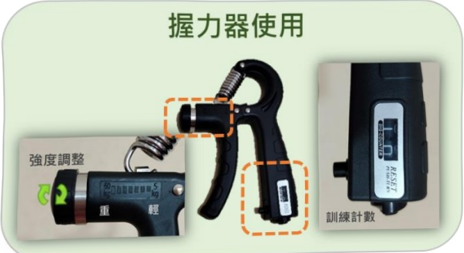

## Grip Training

Can be selected according to individual conditions  
Choose appropriate size and intensity  

Start with low intensity during initial training  

Each repetition takes 2~5 seconds, 20 repetitions per set, at least 3 sets per day, adjust according to individual conditions  

