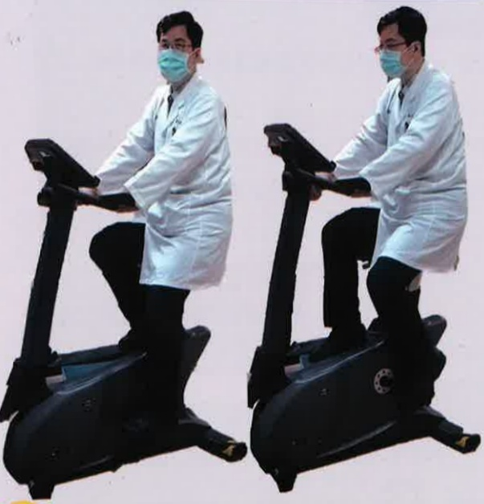

Bicycling exercise requires wearing appropriate footwear.

Perform moderate warm-up exercises.

If a stationary bicycle is available at home, it can be used to adjust speed and resistance.

Recommended amount: at least 3 times per week  
Each session: 15–20 minutes  
If discomfort occurs during exercise, pause and rest.  
The frequency and number of training sessions can be adjusted according to individual conditions.

Crab walking exercise is suitable for individuals with good balance and who can walk independently.  
For individuals with insufficient balance but who can still walk independently, it is recommended to use a wall for support during training.

There are many types and levels of commercially available resistance bands or elastic bands. Choose one that suits your needs.

Resistance bands of different strengths  
Resistance bands of different strengths

Fix elastic bands or resistance bands at the thighs of both legs.

Step 5 steps to the left, then 5 steps to the right.  
Stand with feet shoulder-width apart, knees slightly bent.  
Keep the upper body upright, do not bend the back, and place hands on the waist.  
Repeat each side 4 times to complete one cycle.

## After training, if there is mild muscle soreness in the legs

Mild heat application can help relieve discomfort.  
If discomfort occurs during exercise, pause and rest.  
The frequency and number of training sessions can be adjusted according to individual conditions.