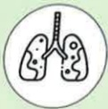

Taiwan Medical Foundation 21X29.7cm Printed in August 2024

# COPD Pulmonary Exercise Training

## Breathing Training – Vibration Expiratory Positive End-Pressure Device Training

## What is COPD?

A chronic inflammatory respiratory condition causing irreversible airway obstruction

8th leading cause of death in Taiwan

🧠 💪 Symptoms: Coughing

Sputum

Shortness of breath

## Risk Factors:

Smoking or secondhand smoke  
Exposure to environmental pollutants  
Occupational exposure  
Family history  
Other lung conditions

## Importance of Breathing Training

1. Chronic inflammation of the airways leads to airway obstruction, potentially causing dynamic overinflation of the lungs and limiting patients' physical activity capacity.

2. Breathing training increases expiratory time, reducing gas retention in the lungs and helping to reduce dynamic overinflation during exercise, thereby improving patients' breathing difficulties.

3. Expiratory Positive Pressure (PEP) devices are adjustable breathing training tools that use a set resistance to maintain a positive pressure state during exhalation. When combined with diaphragmatic relaxation and abdominal muscle engagement, PEP helps prevent airway collapse during exhalation, improves gas retention in the thoracic cavity, and aids in the clearance of respiratory secretions.

## Reference Sources

1. Taiwan Thoracic and Critical Care Society (2022) • 2022 Run, Little Lungs! – COPD Pulmonary Rehabilitation Educational Manual • Taipei: Taiwan Thoracic and Critical Care Society

2. Taiwan Thoracic and Critical Care Society (2017) • What is COPD? – Comprehensive Care Handbook for COPD • Taipei: Taiwan Thoracic and Critical Care Society

## Contact Information

| Yida Hospital | Yida Cancer Treatment Hospital | Yida Dachang Hospital |
|--------------|-------------------------------|------------------------|
| Address: No. 1, Yida Road, Jiaosu Village, Yancheng District, Kaohsiung City | Address: No. 21, Yida Road, Jiaosu Village, Yancheng District, Kaohsiung City | Address: No. 305, Dachang 1st Road, Sanmin District, Kaohsiung City |
| Phone: 07-6150011 ext. 5072 (COPD Individual Care Specialist) | Phone: 07-6150022 ext. 6477 (COPD Individual Care Specialist) | Phone: 07-5599123 (Pulmonary and Thoracic Clinic) |