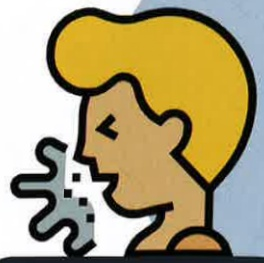
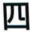
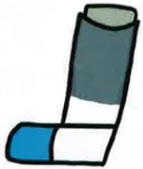

## Four. Symptoms of Acute Deterioration and Management

## Symptoms

In patients with pulmonary obstruction, acute deterioration primarily manifests as a sudden worsening of respiratory symptoms, with the degree of change exceeding their usual baseline, thus requiring a change in medication.

More severe coughing

Increased sputum production

Thicker sputum

Worsening shortness of breath

## Acute Deterioration Symptoms and Management

Prevention and Management

Avoid upper respiratory infections

Avoid exposure to harmful substances

Get vaccinated

Use masks and protective equipment

Once acute deterioration occurs, immediate use of rescue medications and prompt medical consultation should be initiated.

Ventolin

Metered-dose inhaler

Budesonide

Metered-dose inhaler

Budesonide Plus

Metered-dose spray