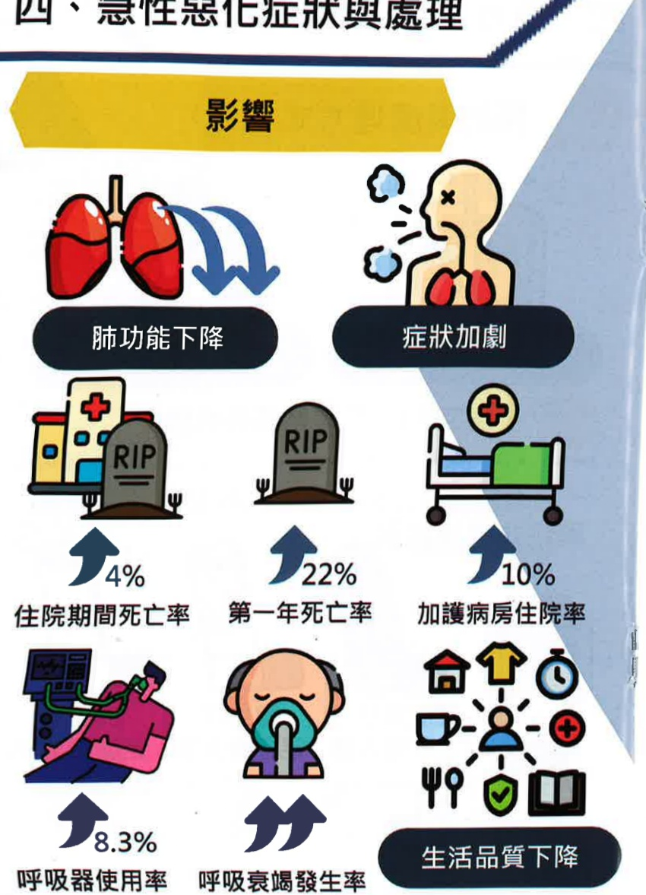
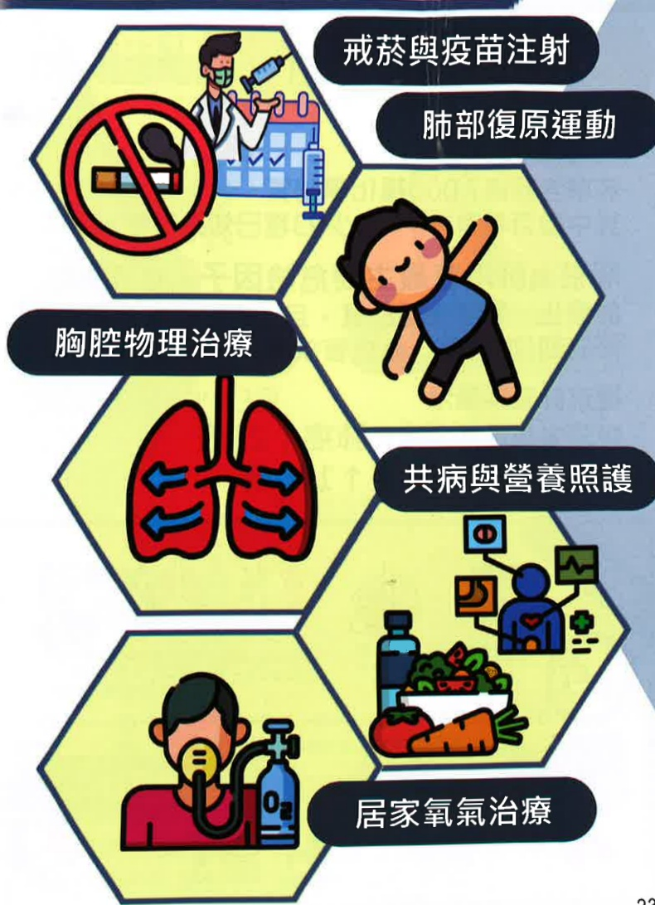

## Acute Exacerbation Symptoms and Management

Decline in lung function  
Worsening symptoms  
In-hospital mortality rate  
One-year mortality rate  
Intensive care unit (ICU) admission rate  
Mechanical ventilation rate  
Rate of respiratory failure  
Decline in quality of life

## Five. Non-pharmacological Treatments for Airway Obstruction

Smoking cessation and vaccination  
Pulmonary rehabilitation exercises  
Thoracic physical therapy

At-home oxygen therapy