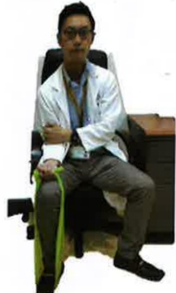

## Five. Non-pharmacological Treatment for Lung Obstruction

## Five. Non-pharmacological Treatment for Lung Obstruction

## Elastic Band Training

Biceps Training

## YouTube

Triceps Training

Biceps Training

Recommended frequency: at least 3 times per week, each session lasting 20–30 minutes

Combining this exercise with pursed-lip breathing enhances effectiveness; the number of repetitions can be adjusted according to individual conditions.

## Walking (Using a Treadmill)

## YouTube

Lower limb exercises are divided into endurance training and resistance training. Combining both types of training can improve physical capacity and muscle strength.

Walking and treadmill training are suitable for individuals with good balance. These exercises can be combined with pursed-lip and diaphragmatic breathing.

Lower limb exercises

When walking, wear appropriate footwear.

For individuals with poor balance:

Use a walking stick or walker for assistance.

If a treadmill is available at home, adjust the speed to suit individual needs.

Recommended frequency: at least 3 times per week, each session lasting 15–20 minutes. The number of repetitions can be adjusted according to individual conditions.

## Sitting to Standing

Lower limb exercises

Cross hands

Hold them in front of the chest

## YouTube

Sitting to standing counts as one movement.

Find a stable, non-tip-over chair. Individuals with poor balance can place a walker in front for support.

Typically, 20 repetitions constitute one cycle. The number of repetitions can be adjusted according to individual conditions.