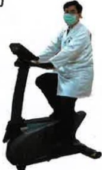

## Five. Non-pharmacological Treatment for Pulmonary Obstruction

## Five. Non-pharmacological Treatment for Pulmonary Obstruction

## Cycling Exercise

## Lower Limb Exercises

Wear appropriate shoes and perform adequate warm-up exercises.  
If a stationary bicycle is available at home, it can be used to adjust speed and resistance.

## YouTube

**Recommended amount**: At least 3 times per week, 15–20 minutes per session. Pause and rest if discomfort occurs during exercise. The frequency and number of sessions can be adjusted according to individual conditions.

## Crab Walking Training

Suitable for individuals with good balance who can walk independently.  
For individuals with insufficient balance but who can still walk independently, it is recommended to assist with support against a wall during training.

## Lower Limb Exercises

Secure elastic bands or resistance bands at the thighs of both legs.  
Take 5 steps to the left, then 5 steps to the right.  
Stand with feet shoulder-width apart.  
Slightly bend the knees.  
Keep the upper body upright, do not bend the back, and place hands on the waist.

Repeat each side 4 times per cycle.

## YouTube

If mild muscle fatigue is felt after training, apply gentle heat to relieve discomfort.  
If discomfort occurs during exercise, pause and rest.  
The frequency and number of training sessions can be adjusted according to individual conditions.

## Grip Ball (or Hand Grip Exercise)

## YouTube

Sarcopenia is a syndrome characterized by a decline in muscle mass, strength, and function throughout the body. Studies have found that approximately 27% of COPD patients have sarcopenia.  
Hand grip strength not only reflects hand muscle strength but also serves as the best indicator of overall muscle strength.

COPD patients with low grip strength and reduced skeletal and respiratory muscle function are at increased risk of acute exacerbations and mortality, leading to deterioration of lung function and reduced quality of life.  
Studies show that for every 1 kg decrease in grip strength, the risk of COPD worsening increases by 5%.

Grip Ball Selection

Moderate  
Too large

Too small

Perform each squeeze for 2–5 seconds, 20 repetitions per set.  
At least 3 sets per day, with adjustments based on individual conditions.