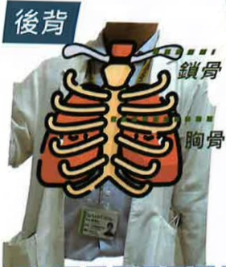

## Five. Non-pharmacological Treatment for Pulmonary Obstruction

## Five. Non-pharmacological Treatment for Pulmonary Obstruction

## Energy-Saving Techniques (also known as Work Simplification Techniques)

By arranging sequential actions, conserve energy and maintain independence in daily activities.

Appropriate use of energy-saving techniques can help patients with breathing difficulties and dyspnea during physical activity to perform daily living activities more easily. Combined with breathing exercises, these techniques can reduce the energy expenditure required during activities, thereby minimizing discomfort caused by the disease.

Energy-Saving Techniques

Taking a bath while sitting

Using a long-handled brush for assistance

Avoiding bending over

## Thoracic Physical Therapy

Timing for chest percussion

One hour before meals

Two hours after meals

Chest percussion tools

Commonly include

Hand formed into a hollow cup shape

Chest percussion cup,

Chest percussion stick, etc.

To reduce the risk of vomiting and aspiration pneumonia caused by coughing after full meals.

Method of chest percussion

Strike at a rate of 3–5 times per second

Recommended duration of 3–5 minutes per area

Perform three times daily

Precautions

Avoid percussion over drainage tubes, surgical incisions, or certain organ areas...

Stop immediately if cyanosis, dyspnea, changes in vital signs, or hemoptysis occur

