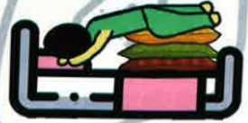
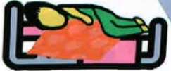

## Five. Non-pharmacological Treatment for Pulmonary Obstruction

## Anterior Chest

Semi-Fowler's position

## Upper Lobe

Bed tilt angle

Recommended 45–60 degrees

## Middle and Lower Lobes

Chest percussion at the supraclavicular area of the upper lung

## Back

Upright sitting position

## Back, Bilateral Simultaneously

Head-down, foot-up position; prone position

Suitable for young individuals with good balance and no contraindications such as hypertension, cardiovascular disease, or increased intracranial pressure

Back

Lateral recumbent position

Prone position (3/4 prone)

Place a pillow under the chest

Percussion (1) under the armpit (2) parallel to the spine at the armpit level (3) below the scapula

## Five. Non-pharmacological Treatment for Pulmonary Obstruction

Comorbidities and Nutritional Care for Pulmonary Obstruction

Comorbidities

Pulmonary obstruction is a chronic inflammatory disease that often coexists with other medical conditions, which may affect the control of pulmonary obstruction.

Cardiovascular disease

Osteoporosis

Lung cancer

Bronchiectasis

Infectious diseases

Sleep apnea