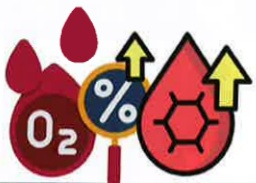

## Five. Non-pharmacological Treatment for Pulmonary Embolism

## Nutritional Care

About 30–60% of patients with pulmonary embolism have malnutrition. Maintaining ideal body weight and fluid balance is important.

Additionally, about 27% have sarcopenia (a syndrome characterized by decreased muscle mass, strength, and function throughout the body).

Declining respiratory muscle function increases the risk of acute exacerbations and mortality, worsens lung function, and affects quality of life.

## High-quality nutrition can improve symptoms and enhance quality of life

High-quality protein

Beans, fish, eggs, meat

One palm-sized portion

Small, frequent meals

Moderate portion sizes

Avoid overeating

Affects breathing

High-quality fats and nuts – cooked by stir-frying or mixing, not boiling

Loss of appetite

Specialized nutritional supplements

Lai Dou

Fluid intake to maintain metabolic balance in the body

Avoid gas-producing foods

Legumes, cauliflower

Onion, sticky rice

*Actual nutritional needs should be adjusted according to individual conditions*

*If any concerns arise, consult a professional nutritionist*

## Five. Non-pharmacological Treatment for Pulmonary Embolism

## Home Oxygen Therapy

Oxygen is a treatment method that requires a prescription from a physician for use.

Improves complications of hypoxemia

Reduces the burden on the respiratory and cardiovascular systems

Alleviates symptoms of dyspnea

Improves quality of life and survival rate