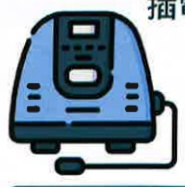

## Five. Non-pharmacological Treatment for Pulmonary Embolism

## Signs of Hypoxia

Dyspnea

Tachycardia

Cold sweat

Confusion

Dizziness

Cyanosis of lips and fingers

## Equipment for Long-term Home Oxygen Therapy

Doctors will select the most appropriate oxygen supply device based on factors such as the patient's activity level, oxygen flow rate, indoor environment, and economic considerations. Common types include:

Electrically powered / portable rechargeable

Oxygen cylinder

Oxygen generator

## Six. Literature References

Taiwan Thoracic and Critical Care Society (2017). *How Much Do You Know About Pulmonary Embolism – A Comprehensive Care Manual for Pulmonary Embolism in Taiwan*. Taipei: Taiwan Thoracic and Critical Care Society

Taiwan Thoracic and Critical Care Society (2021). *2021: Mastering Inhaler Use in Your First Attempt*. Taipei: Taiwan Thoracic and Critical Care Society

Taiwan Thoracic and Critical Care Society (2022). *Clinical Practice Guidelines for Pulmonary Rehabilitation in Taiwan 2022*. Taipei: Taiwan Thoracic and Critical Care Society

Taiwan Thoracic and Critical Care Society (2022). *Run, Little Lungs! – Educational Handbook on Pulmonary Rehabilitation for Pulmonary Embolism*

Taiwan Thoracic and Critical Care Society (2023). *Clinical Care Guidelines for Pulmonary Embolism in Taiwan*. Taipei: Taiwan Thoracic and Critical Care Society

Image sources: https://www.flaticon.com/  
Image sources: https://www.canva.com/