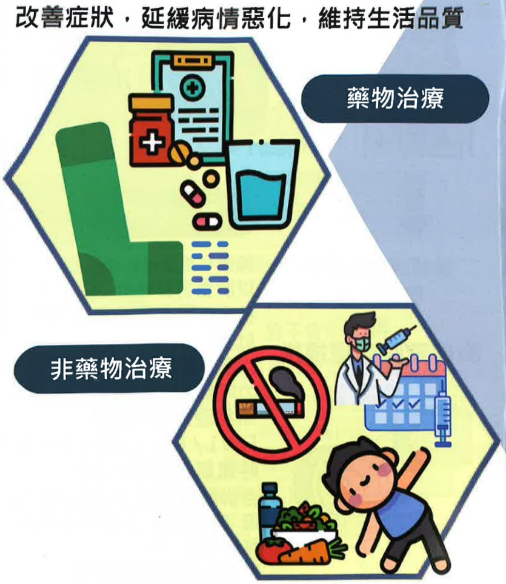

## II. Overview of Diagnosis and Treatment of Pulmonary Obstruction

## Treatment

Improve symptoms, slow disease progression, and maintain quality of life

Pharmacological treatment

## Non-pharmacological treatment

## III. Pharmacological Treatment of Pulmonary Obstruction

## Inhaled Medications

Bronchodilators are the primary medications for treating pulmonary obstruction.

Single agents

For emergency use

Combination agents

Short-acting beta-2 agonists (SABA)

Short-acting

Combination of short-acting beta-2 agonists and short-acting anticholinergics (SABA + SAMA) with inhaled corticosteroids (ICS)

For maintenance use

Long-acting beta-2 agonists (LABA)

Long-acting anticholinergics (LAMA)

Fixed-dose combination

Bronchodilators

(LABA + LAMA)

Fixed combination of inhaled corticosteroids and long-acting beta-2 agonists

(LABA + ICS)