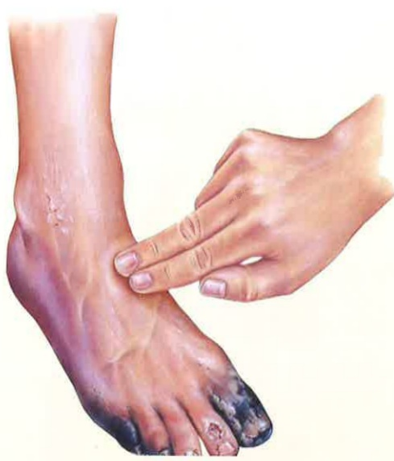

## Five. Surgical Treatment for Peripheral Arterial Occlusion

When medication cannot control the condition, doctors may recommend surgery to restore blood flow. Surgery can be divided into two types:

1. Percutaneous Transluminal Angioplasty (commonly known as balloon angioplasty): In this procedure, the doctor makes a small incision through the skin of the ankle or hand, inserts a catheter into the blood vessel, passes it through the narrowed section, inflates a balloon to widen the vessel, and improves blood flow. Depending on the patient's vascular condition, the doctor may decide to place a stent to support the vessel. This surgery is performed under local anesthesia and has a quick recovery time.

2. Bypass Surgery: When the blockage is severe, the blocked vessel must be replaced with either the patient's own blood vessel or an artificial one. This procedure is used in such cases.

## References

Peripheral Artery Disease | The Foundation to Advance Vascular Cures.  
Peripheral Arterial Disease Treatment in Phoenix, AZ (veinandvascularaz.com).  
Volume 149, Issue 24, 11 June 2024; Pages e1313-e1410 Figure 6. Components of Care for CLTI. (2024 American Heart Association Guidelines for the Treatment of Chronic Peripheral Arterial Occlusion)

## If you have any questions, please contact us. Wishing you a swift recovery.

Yi Da Hospital  
Address: No. 1, Yida Road, Jiaosu Village, Yancheng District, Kaohsiung City  
Phone: 07-6150011  

Yi Da Cancer Treatment Hospital  
Address: No. 21, Yida Road, Jiaosu Village, Yancheng District, Kaohsiung City  
Phone: 07-6150022  

Yi Da Da Chang Hospital  
Address: No. 305, Dachang Road, Sancheng District, Kaohsiung City  
Phone: 07-5599123  

This copyright is not allowed to be reproduced, duplicated, or resold without the consent of the copyright holder.  
Copyright Holder: Yi Da Medical Foundation  
Size: 29.7×20cm | Printed in February 2025 | Newly established in October 2024 HA-9-0129 (1)

## Peripheral Arterial Occlusive Disease

