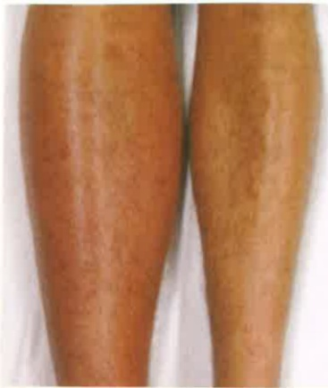

## I. Introduction

Deep vein thrombosis (DVT) occurs due to poor venous blood return in deep veins, leading to symptoms such as swelling in the affected limb.

Deep veins in any part of the body can be affected, most commonly in the lower limbs, though it occasionally occurs in the upper limbs. Clinical manifestations include swelling, pain, and fever in the affected limb. In severe cases, it may lead to obstruction of arterial blood flow, resulting in ischemia and necrosis of the affected limb. If not promptly treated, amputation may occur. Furthermore, deep vein thrombosis can cause fatal complications such as pulmonary embolism if the thrombus detaches.

The causes of deep vein thrombosis are numerous. The most common causes include prolonged bed rest due to conditions such as stroke or post-surgery. Individuals with sedentary or standing occupations are also at risk. Other contributing factors include aging, smoking, obesity, use of oral contraceptives, female gender, pregnancy, malignant tumors, blood disorders, and trauma.

## III. Clinical Symptoms

Unilateral leg swelling is a typical symptom of deep vein thrombosis (dual lower limb thrombosis is rare). Further symptoms may include leg swelling, warmth, tenderness, heaviness, skin pigmentation, ulcers, redness and pain, poor wound healing, and subcutaneous inflammation.

## IV. Diagnosis

Diagnosis can be achieved through non-invasive methods such as deep vein pressure testing, Doppler ultrasound, radioactive isotope scanning, and invasive venography.

## V. Treatment

If any of the above symptoms are present, one should seek medical attention promptly. A physician will assess the severity of the condition and determine whether hospitalization and further examination are required. Treatment will be provided based on the timing of onset and the specific symptoms as follows:

1. Acute phase: Administer thrombolytic agents or anticoagulants. After acute symptoms subside, switch to oral anticoagulants, which should be taken continuously for more than 3–6 months.

2. If anticoagulant therapy is ineffective, catheter-based thrombolysis or aspiration may be performed, or a vascular stent may be placed.

3. Surgical removal of the thrombus via open surgery.

4. Bed rest and elevating the legs to promote venous return and reduce swelling.

### 5. Wear medical-grade compression stockings.

## VI. Care

1. Take anticoagulant medication as prescribed by the doctor; do not adjust dosage arbitrarily. Seek medical attention immediately if bleeding occurs.

2. Measure the circumference of the swollen limb daily to evaluate the effectiveness of treatment.

3. Monitor for the following symptoms: sudden shortness of breath, chest pain, chest tightness, coughing up blood, rapid heartbeat, dizziness, fainting, palpitations, sweating, or sudden swelling, cyanosis, swelling, pallor, coldness, or abnormal sensations in the affected limb. Seek medical care immediately and receive appropriate treatment promptly.

4. Wear medical compression stockings for approximately 3–6 months.

5. Avoid prolonged sitting or standing, and avoid long-term immobility.