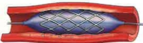

## One. What is angina pectoris?

Angina pectoris, also known as stable coronary artery disease, refers to chest pain caused by myocardial ischemia, typically resulting from coronary artery atherosclerosis or spasm. The severity of angina symptoms varies according to the degree of myocardial hypoxia. Angina is classified into three types: unstable, stable, and variant angina, based on the severity of the disease.

## Two. Clinical Symptoms

## To Improve

· Discomfort in the neck, jaw, teeth, or back; episodes last for several minutes and require rest or medication to relieve.

## Three. Causes

The underlying cause is insufficient myocardial perfusion, resulting in reduced blood supply to the myocardium. This may be due to thrombosis within blood vessels, vascular spasm, or increased oxygen demand—such as during exercise or tachycardia. Insufficient myocardial perfusion primarily results from coronary artery disease. Other types of heart disease or uncontrolled hypertension can also lead to angina.

## Four. Risk Factors

Non-invasive methods: electrocardiogram (ECG), blood tests, echocardiography, exercise stress test, nuclear medicine, CT scan.  
Invasive methods: coronary angiography.

Beta-blockers, calcium channel blockers.

Invasive medical treatments: percutaneous coronary angioplasty, stent placement.

Avoid high-intensity physical activities that increase arterial workload, such as competitive sports like basketball or football. Patients with angina can engage in games similar to bowling or croquet, or participate in light golf activities. The best physical activities for daily life include walking, climbing stairs, practicing tai chi, or gentle yoga.

(2) Dietary aspects: To prevent worsening of coronary arteries, it is best to modify the patient's dietary habits. Patients with angina should avoid animal fats such as lard, pork fat, or smoked meats. These foods accelerate atherosclerosis and must be strictly avoided.