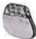
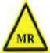

## What is a pacemaker?

A pacemaker is a precise electronic device composed of three parts: a generator, leads, and electrodes. It is surgically implanted under the skin in the chest muscle layer (Figure 1).

Through the leads connected to electrodes inside the heart, it detects when arrhythmias occur and immediately sends electrical pulses to stimulate the heart, helping to regulate its rhythm.

## Patients who may need a pacemaker

Bradycardia — such as Sick Sinus Syndrome (SSS) or atrioventricular conduction block, with a heart rate below 40 beats per minute, leading to symptoms like dizziness and fatigue.

## Causes of arrhythmia

1. Heart disease, diabetes, hypertension, chronic obstructive pulmonary disease (COPD), and hyperthyroidism.

2. Alcohol consumption and certain medications, including drug addiction, may also cause arrhythmias.

3. Inherent predisposition to arrhythmias.

4. Damage to the heart's conduction system due to heart attacks or drug use.

5. Caffeine, emotional fluctuations, and pregnancy may all affect heart rhythm.

## Pacemaker implantation procedure

The doctor makes a small incision (1 to 2 inches long) on the skin under the collarbone. The electrode leads are then passed through the subclavian vein and superior vena cava into the heart. A small pocket is created under the chest muscle layer, where the leads are connected to the pacemaker. After testing normal function, the pacemaker is placed into the pocket, and the incision is closed with stitches.

## Post-operative care

## (1) Wound care

- Keep the wound clean and dry: For several days after surgery, keep the wound area clean and dry to prevent infection.

- Monitor the wound: Watch for signs of infection such as redness, swelling, drainage, or fever. If any of these symptoms appear, contact your doctor immediately.

- Avoid excessive movement: For several weeks after surgery, limit excessive movement of the shoulder or chest, avoid raising your arms or lifting heavy objects, as these actions may pull on the leads of the implanted pacemaker.

## (2) Avoid interference from electronic devices

- Stay away from strong magnetic fields and electronic devices: Some electronic devices or strong magnetic fields may interfere with the operation of a pacemaker. Avoid proximity to strong electromagnetic sources such as MRI (magnetic resonance imaging). Before undergoing such examinations, inform your doctor and present your pacemaker identification card.

## (3) Regular follow-up and check-ups

- Battery check: The battery life of a pacemaker typically lasts 8 to 10 years. Regular follow-up visits are required to monitor device performance, measure battery charge, and check lead function.

## (4) Watch for abnormal symptoms

- If you experience dizziness, chest pain, shortness of breath, or abnormal heartbeats, seek medical attention immediately. These symptoms may indicate device malfunction or other cardiac issues.

## (5) Lifestyle adjustments

- Healthy diet and exercise: Maintain a low-salt, low-fat diet, engage in moderate physical activity, and avoid smoking and excessive alcohol consumption.