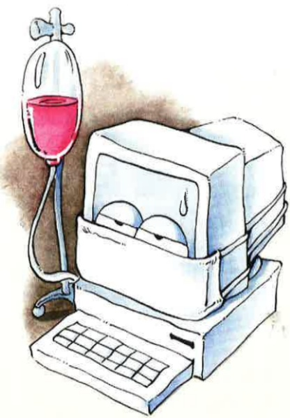

Move, after physical activity, perform gentle exercises, take appropriate rest, avoid overexertion and staying up late.

12. It is best to live with family members to prevent being unable to receive assistance during an attack, which could delay medical treatment and lead to fatal outcomes.

13. Record the circumstances of asthma attacks: how often do they occur? How severe are they? What conditions occur before an attack? Pay attention to whether specific foods, medications, or movements trigger asthma—this information can be useful for your doctor's diagnosis.

## Five: If any of the following situations occur, please return for follow-up immediately:

1. During an asthma attack, do not forcibly endure it—seek medical help as soon as possible to prevent life-threatening complications.

2. Upper respiratory infections: if the throat is inflamed, pneumonia occurs, or severe coughing at night affects sleep, seek medical attention promptly. Do not stop using asthma medication without medical advice, and do not easily believe in folk remedies or non-scientific treatments.

3. Slowed breathing, with a diminished response to surrounding stimuli.

4. Bluish or black lips (cyanosis).

5. Persistent fever exceeding 38.5°C.

## Yida Hospital

Address: No. 1, Yida Road, Jiaosu Village, Yancheng District, Kaohsiung City  
Phone: 07-6150011

## Yida Cancer Treatment Hospital

Address: No. 21, Yida Road, Jiaosu Village, Yancheng District, Kaohsiung City  
Phone: 07-6150022

## Yida Da Chang Hospital

Address: No. 305, Da Chang Road, Simei District, Kaohsiung City  
Phone: 07-5599123

This copyright is not allowed to be reproduced, reprinted, or resold without the consent of the copyright holder.

Copyright Holder: Yida Medical Foundation  
Form Number: HA-1-0016(3)  
Yida Medical Foundation, 20x20 cm, printed in April 2024, revised in March 2019

## Asthma Patient Guidelines

