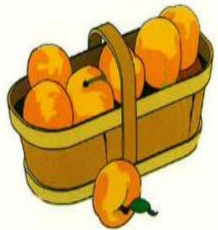

## I. Introduction

Laparoscopic cholecystectomy is a surgical procedure for treating gallbladder diseases. It is less invasive than traditional cholecystectomy, with smaller incisions, better cosmetic results, milder pain, shorter hospital stays, and faster recovery.

## II. Location and Function of the Gallbladder

1. The gallbladder is located beneath the liver and functions to concentrate and store bile produced by the liver. When consuming fatty foods, the gallbladder contracts and releases bile into the small intestine to aid in fat digestion.

2. When bile stasis or imbalances in bile composition occur, bile may crystallize and form gallstones. If stones block bile ducts, symptoms such as upper abdominal pain, vomiting, and indigestion may arise. In severe cases, fever and jaundice may occur.

## III. Surgical Procedure:

Laparoscopic cholecystectomy is currently the most suitable method for treating gallstones.

1. Four small incisions (1.5–1 cm) are made in the abdomen, through which a laparoscope is inserted.

2. In approximately 1–5% of cases during surgery, the procedure may need to be converted to an open surgery, and the surgeon will handle this based on actual circumstances.

## IV. Postoperative Precautions:

1. After anesthesia recovery, patients can lie flat or in a semi-reclining position to relax the abdomen and alleviate wound pain. Frequent position changes are recommended to reduce swelling.

2. Patients will be temporarily fasting on the day of surgery. Once medical staff inform you that it is safe to eat, start with drinking water. If there is no bloating or vomiting, soft foods can be introduced.

3. Mild diarrhea and shoulder or back pain may occur due to gas introduced during laparoscopic surgery, which exerts pressure on the diaphragm nerves. These symptoms will gradually disappear as the gas is absorbed within one week.

4. Wound sutures are typically removed after 6–7 days. Before suture removal, keep the dressing dry and avoid wetting it to prevent wound infection.

## V. Postoperative Dietary Guidelines:

After cholecystectomy, during the initial one to two months, fat intake should be restricted, and a low-fat, low-cholesterol diet should be followed. Afterward, the body adapts and bile is directly released from the liver into the duodenum to aid in fat digestion, allowing a return to normal diet.

(a) Food Selection:

1. Choose a balanced diet to ensure adequate intake of all essential nutrients.

2. Select lean meats (in order of preference: chicken, fish, duck, beef, lamb, pork), and remove all attached fats and skin.

3. Nuts such as sesame seeds, peanuts, walnuts, almonds, cashews, and pine nuts, which are high in fat, should be consumed in limited amounts.

4. Avoid foods that cause gastrointestinal discomfort (such as soybeans) and strongly flavored vegetables (such as onions).

5. Limit intake of high-cholesterol foods, such as internal organs (brain, liver, kidneys), crab roe, fish roe, shrimp roe, and egg yolks. No more than three servings per week are recommended.

6. Increase consumption of fresh fruits and vegetables.