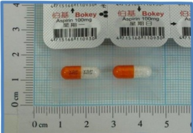

## Stroke Treatment Medications

1. Use antiplatelet drugs to prevent the first occurrence or recurrence of ischemic stroke.

2. For patients with cardiac conditions such as atrial fibrillation, anticoagulants or combined therapy are recommended to prevent recurrence of cardioembolic stroke.

Aspirin (aspirin)

Effect

Antiplatelet drug

Inhibits platelet aggregation

Special risks

May slightly increase the risk of hemorrhagic stroke

Side effects risks

1. Prolongs bleeding time  
2. Gastrointestinal irritation  
3. Rare: hives, angioedema, or asthma

Aspirin is not recommended for patients with high bleeding risk. If you have a history of gastric or intestinal ulcers, gastrointestinal bleeding, or are taking medications that increase bleeding risk, please inform your doctor to assess your bleeding risk!!