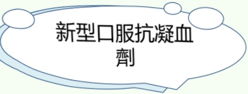
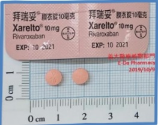

## Stroke Treatment Medications

## Anticoagulants

## Novel Oral Anticoagulants

## dabigatran

## rivaroxaban

## apixaban

edoxaban

• Fixed dosing is available and no regular blood monitoring is required

## Advantages

- Compared to warfarin, these drugs have fewer drug interactions and no food interactions

If medication is not taken on time, the risk of blood clot formation increases

• Gastrointestinal side effects may lead to discontinuation of treatment

## Precautions

- In case of bleeding or emergency surgery, consider using antidotes that can rapidly reverse coagulation abnormalities

It is not possible to assess whether anticoagulant effect is within the therapeutic range

• Caution is required when using in patients with renal impairment